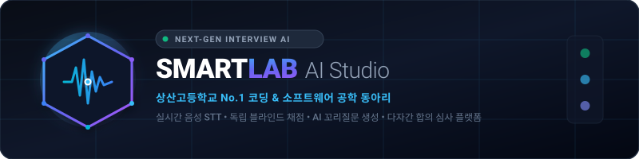
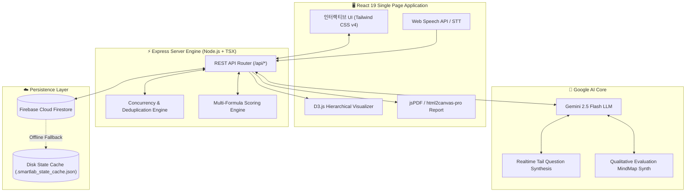

<div align="center">

  

  <br/><br/>

  [](https://github.com)
  [](#)
  [](#)
  [](#)
  [](#)
  [](#)
  [](#)
  [](#)
  [](#)

  <br/>

  <h3>🎯 상산고등학교 대표 소프트웨어 동아리 <strong>SMARTLAB</strong> 신입 선발 다면 면접 &amp; AI 어시스턴트 시스템</h3>
  <p align="center">
    실시간 STT 음성 인식 • 인공지능 꼬리질문 추천 • 독립 블라인드 채점 격리 • D3.js 역량 분석 마인드맵 • 실시간 클라우드 동기화
  </p>

  <p align="center">
    <a href="#-핵심-주요-기능-key-features"><strong>주요 기능 살펴보기 »</strong></a>
    &nbsp;•&nbsp;
    <a href="#-시스템-아키텍처-system-architecture"><strong>아키텍처 구조 »</strong></a>
    &nbsp;•&nbsp;
    <a href="#-시작하기-quick-start"><strong>설치 및 실행 가이드 »</strong></a>
    &nbsp;•&nbsp;
    <a href="#-평가-산출-공식-scoring-formulas"><strong>채점 산출 공식 »</strong></a>
  </p>

</div>

---

## 🌟 개요 (Overview)

**SmartLab AI Interview Evaluator**는 상산고등학교 소프트웨어 학술 동아리 **SmartLab**의 신입 부원 선발 과정을 공정하고 전문적으로 진행하기 위해 구축된 **실시간 다면 AI 면접 평가 플랫폼**입니다.

1인 단독 심사부터 5인 이상의 대규모 심사위원단까지, 모든 면접관이 독립된 화면에서 블라인드 채점을 진행하며, 실시간 음성 스트리밍 분석과 LLM 기반 꼬리 질문 추출을 통해 심층적이고 객관적인 역량 검증을 지원합니다.

```
┌─────────────────────────────────────────────────────────────────────────────┐
│                            SMARTLAB AI STUDIO                               │
│                                                                             │
│   🎙️ Live STT Capture  ──►  🧠 Gemini 2.5 AI Core  ──►  💡 Deep Questions   │
│   🔒 Blind Evaluation  ──►  ⚖️ Trimmed Mean Filter ──►  📊 D3.js MindMap    │
│   ☁️ Firestore Cloud   ──►  📱 Multi-Device Sync   ──►  📑 PDF Scorecards   │
└─────────────────────────────────────────────────────────────────────────────┘
```

---

## ✨ 핵심 주요 기능 (Key Features)

### 1. 🎙️ 실시간 음성 STT & AI 심층 꼬리질문 (Live Speech & AI Assist)
* **초저지연 음성 변환**: 브라우저 Web Speech API 및 백엔드 음성 파이프라인을 결합하여 지원자의 답변을 실시간 텍스트로 트랜스크립션합니다.
* **실시간 맥락 기반 꼬리질문**: 지원자의 발언 내용과 제출된 서류(Google Docs, 포트폴리오)를 교차 검증하여 심층 질문을 실시간 생성합니다.
* **면접관 질문 공유**: AI가 추천한 질문이나 특정 면접관이 작성한 질문을 전체 면접관 화면에 즉시 동기화합니다.

### 2. 🔒 엄격한 독립 블라인드 채점 격리 (Strict Blind Isolation)
* **상호 평가 비공개**: 면접이 진행되는 동안 다른 면접관의 점수와 정성 피드백이 서로에게 일절 노출되지 않습니다.
* **유연한 심사위원단 구성**: 1인 단독 심사부터 2인, 3인, 4인, 5인 이상의 대규모 면접단까지 자유롭게 배정 가능합니다.
* **실시간 입력 상태 표시**: 점수 수치는 가려진 채 각 면접관의 평가 입력 완료 여부(진행 중/완료)만 시각화됩니다.

### 3. 🧠 D3.js 인터랙티브 역량 마인드맵 (Interactive MindMap)
* **다면 지식 그래프**: 지원자의 서류, 발언 내용, 면접관들의 정성 피드백을 종합하여 D3.js 기반 계층형 트리 그래프를 실시간 렌더링합니다.
* **기술 팩트체크 & 역량 진단**: 동아리 적합성, 문제 해결력, 기술 깊이, 커뮤니케이션 항목별 방사형 레이더 차트 및 장단점 분석 리포트를 제공합니다.

### 4. 📑 범용 서류 분석 & 대량 파서 (Document & Batch Parser)
* **Google Docs 인앱 연동**: 외부 링크를 열지 않고도 구글 닥스 원본 문서를 면접 화면 내에서 즉시 팝업/분할 뷰로 열람합니다.
* **PDF / Word / 이미지 OCR**: PDF, DOCX, 이미지 파일 지원서를 즉각 텍스트로 추출하여 면접관에게 핵심 요약본을 제공합니다.
* **원클릭 다건 등록**: 텍스트 및 테이블 복사-붙여넣기로 수십 명의 지원자 프로필과 시간표를 한 번에 자동 파싱합니다.

### 5. 📊 통계 대시보드 & PDF 성적표 발행 (Analytics & Export)
* **실시간 통계 및 순위표**: 절사평균(Trimmed Mean), 중위수(Median), 올림픽 룰 등 고급 통계 공식을 적용한 종합 석차를 산출합니다.
* **공식 성적표 출력**: 고해상도 PDF 다운로드 및 인쇄 최적화 리포트를 지원합니다.

---

## 🛠️ 기술 스택 (Tech Stack)

<div align="center">

| 계층 (Layer) | 주요 기술 및 라이브러리 |
| :--- | :--- |
| **Frontend** |     |
| **Visualization** |    |
| **Backend & Server** |    |
| **AI & LLM** |   |
| **Database & Cloud** |   |

</div>

---

## 🏛️ 시스템 아키텍처 (System Architecture)



---

## 📐 평가 산출 공식 (Scoring Formulas)

SmartLab 시스템은 평가위원단의 규모와 채점 정책에 맞춰 4가지 점수 합산 알고리즘을 지원합니다:

| 산출 모드 | 적용 원리 | 권장 상황 |
| :--- | :--- | :--- |
| **가중 절사 평균 (Trimmed Mean)** | 3인 이상 평가 시 **최고점과 최저점을 제외**한 후 잔여 점수를 가중 합산 (2인 이하는 산술평균 자동 적용) | **기본 권장** (심사위원 개인 편향 및 극단적 이상치 완벽 배제) |
| **중위수 (Median)** | 각 평가 항목별 면접관 부여 점수들의 **중앙값**을 취합 | 이상치 영향도가 극단적으로 우려되는 경우 |
| **가중 산술 평균 (Weighted Mean)** | 모든 면접관의 점수를 항목별 가중치에 맞춰 단순 평균 합산 | 심사위원이 1~2인이거나 전원 합의 기반일 때 |
| **올림픽 합산 (Olympic Rule)** | 각 항목별 최고점 1개와 최저점 1개를 탈락시킨 후 나머지 점수 합산 | 다수의 심사위원이 참가하는 대규모 공개 심사 |

---

## 🚀 시작하기 (Quick Start)

### 1. 사전 요구사항 (Prerequisites)
- **Node.js**: v18.0.0 이상 (v20+ 권장)
- **NPM** 또는 **Bun** / **Yarn**

### 2. 저장소 클론 및 패키지 설치
```bash
# 1. 저장소 클론
git clone https://github.com/your-org/smartlab-interview-evaluator.git
cd smartlab-interview-evaluator

# 2. 의존성 설치
npm install
```

### 3. 환경 변수 설정 (`.env`)
프로젝트 루트 경로에 `.env` 파일을 생성하고 아래 변수를 입력합니다:

```env
# Google Gemini AI API 키 (필수)
GEMINI_API_KEY=your_gemini_api_key_here

# (선택) Firebase Cloud Firestore 구성 (미설정 시 로컬 JSON 캐시로 자동 대체)
FIREBASE_PROJECT_ID=your_project_id
```

### 4. 개발 서버 실행
```bash
npm run dev
```
브라우저에서 `http://localhost:3000`으로 접속합니다.

### 5. 프로덕션 빌드 & 실행
```bash
# 프로덕션 번들 빌드
npm run build

# 프로덕션 서버 구동
npm start
```

---

## 📁 프로젝트 폴더 구조 (Project Structure)

```
smartlab-interview-evaluator/
├── 📁 assets/                     # 프로젝트 공식 SVG 로고 및 에셋
│   └── logo.svg
├── 📁 server/                     # Express 백엔드 서버 로직
│   ├── 📁 routes/                 # 모듈별 REST API 라우터
│   │   ├── ai.ts                  # Gemini LLM 실시간 STT & 꼬리질문 생성
│   │   ├── candidatePortal.ts     # 지원자 전용 실시간 포털 API
│   │   ├── candidates.ts          # 지원자 CRUD 및 동시성 락 제어
│   │   ├── evaluations.ts         # 블라인드 평가 점수 제출 및 격리
│   │   └── rooms.ts               # 면접 평가실 및 심사위원 관리
│   ├── ai.ts                      # Gemini 2.5 Flash 연동 클라이언트
│   ├── db.ts                      # Firestore + Local Cache 하이브리드 DB
│   └── firebase.ts                # Firebase Cloud Firestore 초기화
├── 📁 src/                        # React 19 프론트엔드 어플리케이션
│   ├── 📁 components/             # 핵심 UI 컴포넌트
│   │   ├── AdminPortalPage.tsx    # 관리자 종합 설정 및 룸 개설
│   │   ├── AdminStatsDashboard.tsx# 실시간 순위표 및 통계 대시보드
│   │   ├── CandidateListPage.tsx  # 지원자 명단 및 면접 현황 카드
│   │   ├── InterviewRoom.tsx      # 실시간 면접 평가 메인 콘솔
│   │   ├── STTConsole.tsx         # 실시간 음성 자막 및 꼬리질문 패널
│   │   ├── MindMapModal.tsx       # D3.js 기반 역량 분석 마인드맵
│   │   └── UniversalParserModal.tsx # 문서 OCR 및 대량 파서
│   ├── 📁 lib/                    # 유틸리티 및 계산 라이브러리
│   │   ├── scoring.ts             # 절사평균/중위수 통계 계산 엔진
│   │   └── utils.ts               # CSS 클래스 헬퍼
│   ├── App.tsx                    # 메인 상태 관리 및 라우터 컨테이너
│   ├── index.css                  # Tailwind CSS v4 스타일시트
│   └── types.ts                   # 전역 TypeScript 인터페이스 정의
├── server.ts                      # 백엔드 진입점 & Vite SSR 미들웨어
├── vite.config.ts                 # Vite 번들러 설정
└── package.json                   # 프로젝트 의존성 및 스크립트
```

---

## 🔒 보안 및 개인정보 보호 (Privacy & Blind Guarantee)

* **완전 블라인드 격리 (Blind Protection)**: 각 면접관의 평가는 백엔드 레벨에서 세션별로 격리되며, 면접 종료 전까지 타 면접관의 점수가 API 응답에 포함되지 않습니다.
* **동시성 안전 제출 (Concurrency Safety)**: 다수의 면접관이 동일 지원자를 동시에 채점하거나 코멘트를 입력해도 데이터 유실이 없도록 낙관적/비관적 잠금 메커니즘을 적용했습니다.
* **서버 사이드 API Key 은닉**: Gemini API Key 및 비밀 자격증명은 클라이언트에 노출되지 않고 오직 Node.js 서버 환경에서만 안전하게 실행됩니다.

---

<div align="center">

  <br/>
  
  **SMARTLAB @ Sangsan High School**<br/>
  <sub>Creative Software Engineering &amp; AI Research Group</sub>

  <br/><br/>

  [](https://github.com)
  
</div>
